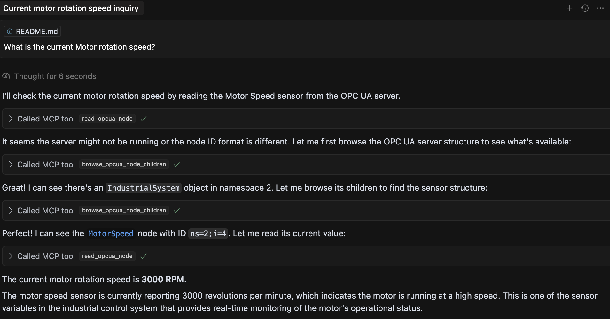
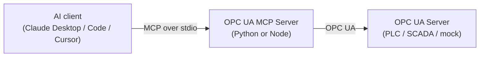

<div align="center">

# 🏭 OPC UA MCP Server

**Read industrial sensors and control equipment on any OPC UA server — through natural language with Claude and any MCP client.**

[](https://www.npmjs.com/package/opcua-mcp-server)
[](https://pypi.org/project/opcua-mcp-server/)
[](https://www.npmjs.com/package/opcua-mcp-server)
[](https://github.com/midhunxavier/OPCUA-MCP/actions/workflows/ci.yml)
[](LICENSE)
[](https://github.com/midhunxavier/OPCUA-MCP)

[](https://www.python.org)
[](https://nodejs.org)
[](https://modelcontextprotocol.io)
[](CONTRIBUTING.md)

[Quick Start](#quick-start) · [Install](docs/install.md) · [Tools](#tools) · [Examples](docs/examples.md) · [Compatibility](docs/compatibility.md) · [Architecture](docs/architecture.md) · [Testing](docs/testing.md) · [Roadmap](ROADMAP.md) · [Contributing](CONTRIBUTING.md)

</div>



## Overview

Thirteen MCP tools over plain OPC UA: read and write nodes, browse the address
space, call methods, read history and server-side aggregates, and subscribe to
data changes, events and alarms. It connects to any server that speaks OPC UA —
PLC, SCADA gateway or historian.

What is actually offered on a given connection depends on three things: what the
server advertises it can do, what the OPC UA account is permitted to do, and
which [tool profile](#deciding-what-the-agent-may-do) you configured. The default
profile is read-only.

There are **two interchangeable implementations**, Python and TypeScript/Node,
held to one shared contract by the test suite — same tools, same arguments, same
responses. Install whichever your machine already has; nothing below depends on
the choice.

Which servers and operations the test suite exercises, and which are only
reported by users, is set out in
**[docs/compatibility.md](docs/compatibility.md)**.

**One process talks to one endpoint.** `OPCUA_SERVER_URL` is read once at
startup, every tool targets it, and the only transport is stdio — so the server
runs beside the MCP client that started it, and each client gets its own OPC UA
session. That is the right shape for an engineer at a workstation, which is what
this is built for. A site with five PLCs runs five entries in the client config,
and if OPC UA sessions are a licensed resource on your equipment, count on one
per client per endpoint. What it would take to be a shared plant-wide gateway
instead is set out in the [roadmap](ROADMAP.md#considered-and-set-aside).



## Quick Start

**Claude Desktop, nothing installed?** Download the `.mcpb` bundle from the
[latest release](https://github.com/midhunxavier/OPCUA-MCP/releases/latest) and
drag it into **Settings → Extensions**. It carries the server and every
dependency, Claude Desktop supplies the runtime, and the OPC UA endpoint is a
field in the settings form — no Node, no Python, no JSON to edit.

**Already have a runtime?** Install the package and let it write the config:

```bash
npm install -g opcua-mcp-server        # or: uv tool install opcua-mcp-server
opcua-mcp-server --install claude-desktop --url opc.tcp://192.168.0.10:4840
```

`--install` writes absolute paths rather than a bare `npx`, which matters more
than it sounds: Claude Desktop is launched from the GUI and does not inherit a
login shell's `PATH`. `--dry-run` shows the result without writing it. Without a
permanent install, `npx` and `uvx` fetch the package on demand.

**Prefer to configure it yourself?** Add this to your MCP client config and point
`OPCUA_SERVER_URL` at your OPC UA endpoint:

```json
{
  "mcpServers": {
    "opcua": {
      "command": "npx",
      "args": ["-y", "opcua-mcp-server"],
      "env": { "OPCUA_SERVER_URL": "opc.tcp://localhost:4840" }
    }
  }
}
```

<details>
<summary>Python instead of Node, or Claude Code in one line</summary>

The two runtimes are interchangeable — same tools, same arguments, same
responses — so this is a question of what is already on the machine, not of
capability. For the Python package, swap the command:

```json
{ "command": "uvx", "args": ["opcua-mcp-server"] }
```

Claude Code needs no file at all:

```bash
claude mcp add opcua -e OPCUA_SERVER_URL=opc.tcp://localhost:4840 -- npx -y opcua-mcp-server
```

</details>

Single-file executables for machines with no runtime and no network, and what to
do when Claude Desktop cannot start the server:
**[docs/install.md](docs/install.md)**.

> **No OPC UA server to hand?** This repo ships a mock industrial plant — see
> [Try it against the mock](#try-it-against-the-mock).

## Tools

Both servers expose the same thirteen tools, defined once in
[`contract/tools.json`](contract/tools.json) so they cannot drift apart.

| Tool | What it does |
|---|---|
| `read_opcua_nodes` | Read one or more nodes — value, data type, status, timestamps, engineering unit and range |
| `browse_opcua_nodes` | List children, walk a subtree, resolve a browse path, search by name |
| `write_opcua_nodes` | Write to one or more nodes |
| `call_opcua_method` | Invoke a method on an object node |
| `get_server_status` | Connection state, server health and the namespace array |
| `subscribe_opcua_nodes` | Watch nodes for data changes instead of polling them |
| `list_subscriptions` | The active subscriptions, each with its buffered changes |
| `unsubscribe_opcua_nodes` | Cancel subscriptions |
| `subscribe_events` | Start collecting events from a notifier node |
| `read_events` | Read the events collected since the last read |
| `list_active_alarms` | The alarms the server is currently retaining |
| `acknowledge_alarm` | Acknowledge one of them, with a comment |
| `read_opcua_history` † | Historical values, raw or summarised by a server-side aggregate |

† **Capability-gated.** `read_opcua_history` appears only when the connected
server advertises historical access (`AccessHistoryDataCapability`) or aggregates
(a non-empty `AggregateFunctions` folder). Its `aggregate_function` argument
appears only with the latter, and its description then lists the functions that
server actually offers. What a server cannot do is not on the menu, rather than
failing at call time.

**One tool per operation, not one per arity.** Reading one node and reading fifty
is the same request with a longer list, so it is one tool and one code path.
Batching is the caller's choice, not a different API.

Both servers also expose one **resource**, `opcua://subscriptions`: the same
records `list_subscriptions` returns, re-readable without spending a tool call.

Full per-tool reference with inputs, outputs and a node-ID map:
**[docs/examples.md](docs/examples.md)**.

## Example usage in conversation

Once configured, you can ask in plain language:

- *"What's the current temperature reading from the reactor vessel?"*
- *"Set the valve position to 80%"*
- *"Show me all available variables in the system"*
- *"What was the temperature over the last hour?"*
- *"Start production on line 1 at 100 units/hour"*
- *"Give me the hourly average temperature for today"*
- *"Watch the tank level and tell me what it does over the next minute"*
- *"What alarms are active right now?"*
- *"Acknowledge the high-temperature alarm — I'm looking into it"*

Every answer comes back as a record, not prose. A reading carries its data type,
its OPC UA status and both timestamps — because quality and age are what decide
whether a value can be acted on, and a bare number carries neither:

```
read_opcua_nodes  node_ids=["ns=2;i=3", "ns=2;i=12"]
→ { "node_id": "ns=2;i=3", "value": 23.10, "data_type": "Double", "status": "Good",
    "source_timestamp": "2026-09-10T13:15:12.214Z",
    "server_timestamp": "2026-09-10T13:15:12.214Z",
    "engineering": { "unit": "°C", "unit_description": "degree Celsius",
                     "eu_range": { "low": 0, "high": 150 },
                     "instrument_range": { "low": -50, "high": 250 } } }
  { "node_id": "ns=2;i=12", "value": true, "data_type": "Boolean", "engineering": null, … }
```

`engineering` is what the plant says the number *means*, read from the node's own
OPC UA properties: `23.10` cannot be told from °C, PSI or %, and cannot be told
from a trip. It is `null` for a node that publishes none, which is most of them —
only an `AnalogItemType` carries it. The range is not only reported: a write
outside the node's own `EURange` is refused before anything is sent, which is a
safety bound the equipment declared rather than one a human retyped.

A walk of the address space says whether it finished, so a partial answer can
never pass for a complete one:

```
browse_opcua_nodes  depth=4  node_class="Variable"  include_values=true
→ { "nodes": [ { "node_id": "ns=2;i=3", "browse_name": "2:Temperature",
                 "node_class": "Variable", "data_type": "Double", "value": 26.34, … } ],
    "truncated": false, "inspected": 22 }
```

**Every tool declares a result shape**, and both runtimes are held to it. The
shapes live in `contract/tools.json`; the suite checks each runtime's *actual*
output against them and then diffs the two runtimes against each other — so a
client that has learned one server's answers can read the other's.

A per-node rejection is a status inside a successful result, never a failed call:
one unreadable node in a batch of fifty must not discard the other forty-nine.
Only a failure of the whole operation is an error.

Events are collected, not pushed: MCP is request/response, so `subscribe_events`
starts a real OPC UA subscription in the background and `read_events` hands over
what has arrived since you last asked. `list_active_alarms` does not need one —
it asks the server for its retained conditions directly (ConditionRefresh).

## Configuration

Both runtimes read the same environment variables:

| Variable | Default | Meaning |
|---|---|---|
| `OPCUA_SERVER_URL` | `opc.tcp://localhost:4840` | OPC UA endpoint to connect to |
| `OPCUA_SECURITY_POLICY` | `None` | `None`, `Basic128Rsa15`, `Basic256`, `Basic256Sha256` — plus `Aes128_Sha256_RsaOaep` and `Aes256_Sha256_RsaPss` on the Node runtime |
| `OPCUA_SECURITY_MODE` | `SignAndEncrypt` once a policy is set, otherwise `None` | `None`, `Sign` or `SignAndEncrypt` |
| `OPCUA_CLIENT_CERT` | — | Client certificate (PEM/DER). Required for any policy other than `None` |
| `OPCUA_CLIENT_KEY` | — | Private key for `OPCUA_CLIENT_CERT` |
| `OPCUA_APPLICATION_URI` | the `subjectAltName` URI of `OPCUA_CLIENT_CERT` | Application URI announced to the server. Set it only for a certificate that carries no URI of its own |
| `OPCUA_SERVER_CERT` | — | The OPC UA **server's** certificate, pinned. Without it, encryption protects against eavesdropping but not against an impostor endpoint. Requires a policy other than `None` |
| `OPCUA_USERNAME` | — | Username identity; the session is anonymous when unset |
| `OPCUA_PASSWORD` | — | Password for `OPCUA_USERNAME` |
| `OPCUA_USER_CERT` | — | Certificate identifying the **user**, for X.509 authentication. A different key pair from `OPCUA_CLIENT_CERT`, which secures the channel. Cannot be combined with `OPCUA_USERNAME` |
| `OPCUA_USER_KEY` | — | Private key for `OPCUA_USER_CERT`. Signs the server's challenge; never sent |
| `OPCUA_PROFILE` | `observe` | `observe`, `operator`, or `full` tool profile (`read-only` is an alias for `observe`) |
| `OPCUA_POLICY_FILE` | — | Optional version-1 JSON policy file; environment variables override it |
| `OPCUA_ALLOWED_TOOLS` | — | Comma-separated allowlist that can only narrow the selected profile |
| `OPCUA_ALLOWED_WRITE_NODES` | — | Comma-separated node IDs writable by the `operator` profile. `ns=2;i=5` or, preferably, `nsu=<namespace-uri>;i=5` — see [Writing an allowlist that stays correct](#writing-an-allowlist-that-stays-correct) |
| `OPCUA_ALLOWED_METHODS` | — | Comma-separated `object_node_id|method_node_id` pairs callable by `operator` |
| `OPCUA_ALLOW_ACKNOWLEDGE_ALARMS` | `false` | Allow `operator` to acknowledge alarms |
| `OPCUA_ALLOW_INSECURE_CONTROL` | `false` | Lab-only override permitting control tools without OPC UA channel security |
| `OPCUA_ALLOW_OUT_OF_RANGE_WRITES` | `false` | Allow a write outside the `EURange` the OPC UA server itself published for that node — see [Bounding the value, not only the node](#bounding-the-value-not-only-the-node) |
| `OPCUA_AUDIT_FILE` | — | Append-only file for the control audit trail, one JSON object per line, written *beside* stderr. A file that cannot be opened stops the server rather than falling back |
| `OPCUA_OPERATOR_ID` | — | Label stamped on every audit record, so a shipped log says which deployment a control call came from |
| `OPCUA_RECONNECT_INITIAL_DELAY_MS` | `1000` | Delay before the first reconnection attempt; doubles each attempt |
| `OPCUA_RECONNECT_MAX_DELAY_MS` | `8000` | Ceiling for that doubling |
| `OPCUA_RECONNECT_MAX_RETRY` | `3` | Retries after the first attempt. `0` disables retrying, `-1` retries forever |
| `OPCUA_SESSION_TIMEOUT_MS` | `60000` | Session timeout asked of the OPC UA server; also sets the keep-alive period |

### Staying connected

Neither server needs restarting when the OPC UA server does. A dropped
connection is retried with exponential backoff on the four
`OPCUA_RECONNECT_*` / `OPCUA_SESSION_TIMEOUT_MS` settings above, the read and
write paths transparently re-establish a dead session, and the data-change
subscriptions an agent is holding are re-created on the new session — the IDs
keep working and the values already buffered are still there to be read.

Reconnection is driven by tool calls rather than by a timer: if the endpoint is
unreachable when the MCP client starts, the server still starts, and the first
call that needs a session connects. `get_server_status` is the one tool that
answers either way — it reports `connected: false` and the reason instead of
failing, and every other tool's error points at it.

The defaults (three retries, 1–8s apart) keep a single tool call from hanging for
long. Raise `OPCUA_RECONNECT_MAX_RETRY` for a site where outages are measured in
minutes; the last waiting a call will do is the sum of the delays.

### Deciding what the agent may do

Three profiles, and the default is the restrictive one:

| `OPCUA_PROFILE` | What it offers |
|---|---|
| `observe` *(default)* | Read, browse, history and monitoring. No writes, no methods |
| `operator` | The above, plus **only** the write targets and methods you allowlist |
| `full` | Every tool |

`operator` is the one worth understanding. A write to a node outside
`OPCUA_ALLOWED_WRITE_NODES` is refused before anything reaches OPC UA, and one
forbidden target rejects an entire batch rather than letting part of it through.
Both `operator` and `full` also require a secured OPC UA channel unless
`OPCUA_ALLOW_INSECURE_CONTROL=true` says otherwise in as many words.

The policy is enforced again on **every call**, not only when tools are listed —
an MCP client may hold a stale catalogue, and a hidden tool is a usability
feature rather than a security boundary. Every control call is also recorded —
with its targets, its outcome, the endpoint it went to and the session it rode
on — to stderr and, if `OPCUA_AUDIT_FILE` is set, to an append-only file beside
it.

### Bounding the value, not only the node

An allowlist says *where* a write may go. It does not say *what* may be written,
and for the one product category where a wrong number is a physical event that is
the weaker half: a model that has correctly identified the right setpoint and
hallucinated `9999` instead of `99.9` is fully allowlisted.

Two bounds now apply.

**The one the plant published.** An OPC UA `AnalogItemType` carries an `EURange` —
what the value holds in normal operation. Both servers read it, report it on every
reading, and refuse a write outside it before anything is sent. No configuration:
the equipment set the bound. Set `OPCUA_ALLOW_OUT_OF_RANGE_WRITES=true` for the
deployments that write outside normal operation on purpose.

**The one you write.** In a policy file, a `writable_nodes` entry may carry `min`,
`max`, `enum` or `max_change`:

```json
{
  "control": {
    "writable_nodes": [
      "nsu=urn:plant:line-a;s=Line1.SpeedSetpoint",
      { "node": "nsu=urn:plant:line-a;s=Line1.Temperature", "min": 0, "max": 120 },
      { "node": "nsu=urn:plant:line-a;s=Line1.Mode", "enum": ["AUTO", "MANUAL"] }
    ]
  }
}
```

A bare node id stays legal. Both bounds apply, so a policy can only ever narrow
what the equipment already allows. `OPCUA_ALLOWED_WRITE_NODES` is a comma-separated
list and cannot express a bound — a bounded node needs the file. The full shape is
in **[SECURITY.md](SECURITY.md#bounding-the-value-not-only-the-node)**.

### Writing an allowlist that stays correct

`OPCUA_ALLOWED_WRITE_NODES` and `OPCUA_ALLOWED_METHODS` accept two forms:

```
ns=2;i=5                       # namespace index — resolved per session
nsu=urn:plant:line-a;i=5       # namespace URI — stable across sessions
```

**Prefer the second.** A namespace *index* is not a property of a node; it is
that node's position in the server's NamespaceArray for the current session. A
firmware update, an added namespace or a reordered load can move it — and an
allowlist written `ns=2;i=5` then authorises writes to a **different physical
node**, with nothing anywhere reporting that anything changed.

The namespace URI is the stable name. Both servers read the NamespaceArray on
every connect and resolve URI-pinned entries against it, so the allowlist follows
the node rather than the index. An entry naming a URI the server does not
publish matches nothing and is reported on stderr at connect time.

Spelling does not matter: `i=2253` and `ns=0;i=2253` are the same node, entries
are trimmed, and both runtimes canonicalise identically (pinned by
`tests/fixtures/node-id-forms.json`).

Larger deployments can put all of it in a version-1 JSON file
(`OPCUA_POLICY_FILE`) instead of the environment; the shape, and a worked
example, are in **[SECURITY.md](SECURITY.md#tool-profiles-and-control-policy)**.

### Connecting securely

The defaults are unencrypted and unauthenticated, which suits the mock plant and
nothing else. A real deployment wants a policy, a client certificate, an identity
and a pinned server certificate:

```bash
OPCUA_SECURITY_POLICY=Basic256Sha256     # implies SignAndEncrypt
OPCUA_CLIENT_CERT=/etc/opcua/client.pem  # this server's identity
OPCUA_CLIENT_KEY=/etc/opcua/client_key.pem
OPCUA_SERVER_CERT=/etc/opcua/server.pem  # pin the server you meant to reach
OPCUA_USERNAME=mcp-operator              # or OPCUA_USER_CERT for X.509
OPCUA_PASSWORD=…
```

Names are case-insensitive, and a policy on its own implies `SignAndEncrypt`.
Anything the OPC UA spec cannot honour — a mode without a policy, a policy
without a certificate, a username without a password, a path that does not exist
— is refused at startup with a message naming the variable, rather than failing
later against live equipment.

`OPCUA_USERNAME` / `OPCUA_PASSWORD` authenticate the session but encrypt nothing:
without a security policy the password crosses the network in clear text unless
the server's user-token policy protects it, and both servers say so on stderr.
Pair credentials with a policy.

Why each of these matters, what is still not protected, and the full X.509 story:
**[SECURITY.md](SECURITY.md)**. Generating a certificate a server will accept —
including a file-naming trap on the Python runtime — is
**[docs/certificates.md](docs/certificates.md)**.

## Try it against the mock

The repo ships a simulated industrial plant — sensors, actuators, methods,
history and events — so you can try the tools without touching real equipment.

```bash
git clone https://github.com/midhunxavier/OPCUA-MCP.git && cd OPCUA-MCP
uv sync --all-packages
uv run --no-sync opcua-mock-server     # opc.tcp://localhost:4840/freeopcua/server/
```

Point your MCP client at that URL — [`.mcp.json.example`](.mcp.json.example) is a
ready-made config. Two smaller mocks cover what the main one deliberately does
not model, server-side aggregates and acknowledgeable alarms; the
[compatibility matrix](docs/compatibility.md) says which covers what, and
[docs/testing.md](docs/testing.md) has an MCP Inspector walkthrough with example
prompts.

## Development & testing

```bash
uv sync --all-packages                      # one-time workspace setup
cd tests
uv run --no-sync pytest unit/               # fast, no server needed (<1s)
uv run --no-sync pytest                     # unit + end-to-end, both runtimes
uv run --no-sync pytest -m smoke smoke/     # published-artifact smoke tests
```

Full guide, including the MCP Inspector and AI-agent walkthroughs:
**[docs/testing.md](docs/testing.md)**. Project layout and how to add a tool:
**[CONTRIBUTING.md](CONTRIBUTING.md)**. How it fits together:
**[docs/architecture.md](docs/architecture.md)**.

## Security

> [!WARNING]
> Both runtimes default to an **observe-only** tool profile, but the OPC UA
> connection itself still defaults to `SecurityPolicy.None` and
> `MessageSecurityMode.None` — unauthenticated and unencrypted. That combination
> is for the bundled mock and local development. For production, configure both
> channel security and an `operator` allowlist — see the two sections above. Control tools are
> blocked on an insecure channel unless the explicit lab override is set.

See [SECURITY.md](SECURITY.md) for the security posture, what the servers do and
do not verify, and how to report a vulnerability;
[docs/certificates.md](docs/certificates.md) for client certificates and trust
setup.

The MCP policy is defense in depth, not a replacement for OPC UA authorization.
Scope the OPC UA account to the same nodes and methods; use a separate read-only
account for `observe` deployments.

## Contributing

Contributions are welcome — see **[CONTRIBUTING.md](CONTRIBUTING.md)** for
project layout, local development, adding a new tool to both servers, and PR
conventions. What is planned next is in [ROADMAP.md](ROADMAP.md); changes that
have landed are tracked in [CHANGELOG.md](CHANGELOG.md).

Results from a real OPC UA server are the most useful thing to send: open a
[compatibility report](https://github.com/midhunxavier/OPCUA-MCP/issues/new?template=compatibility_report.md)
saying which server, which version and which tools worked. Test only on
equipment you are authorised to use, and keep writes and method calls to a
simulator or lab.

## License

MIT — see [LICENSE](LICENSE).
