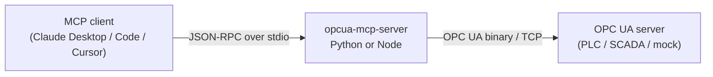

# Architecture

How the pieces fit together, and the three invariants that are easy to break.



## Two runtimes, one tool surface

The repo ships the same MCP server twice — once in Python, once in
TypeScript/Node. They are interchangeable: same tool names, same descriptions,
same parameters, same error wording. Users pick whichever runtime their stack
already has.

That interchangeability is not maintained by discipline. It is maintained by
`contract/tools.json`, the single source of truth for the tool surface:

| | How it uses the contract |
|---|---|
| **Node** | Builds its `tools/list` response directly from it. `npm run build` copies it to `build/contract.json` so the npm package is self-contained. |
| **Python** | Reads tool descriptions and capability node IDs from it. Input schemas are derived by FastMCP from the function signatures, and checked against the contract by a test. |

`tests/e2e/test_contract_parity.py` starts both servers and asserts each
advertises exactly the contract's applicable tools, with matching descriptions
and parameter sets. `tests/unit/test_contract.py` checks the contract file itself
is well-formed.

**Adding a tool** therefore means editing the contract, adding the per-tool logic
in each runtime, and adding a test — see [CONTRIBUTING.md](../CONTRIBUTING.md).
You never edit a tool list by hand.

## Capability gating

Some tools only make sense against servers that support them. Rather than
advertising a tool that always fails, each runtime probes the connected OPC UA
server at `tools/list` time and filters:

| Capability | Probe | Gates |
|---|---|---|
| `history` | Read `AccessHistoryDataCapability` (`ns=0;i=11193`) is true | `read_history_opcua_node` |
| `aggregate` | Browse `AggregateFunctions` (`ns=0;i=2997`) is non-empty | `read_aggregate_opcua_node` |

The probes are **best-effort by design**: any failure yields "not supported"
rather than an error. A transient OPC UA outage must not strip the core tools
from `tools/list`.

> There are two mocks, on purpose. The main one (`packages/mock-server/`, :4840)
> enables history and advertises **no** aggregate functions, so the suite can
> assert the aggregate tool stays hidden when unsupported. The second
> (`packages/mock-server-aggregate/`, :4841) advertises aggregates, so the read
> path itself is covered on both runtimes.

## The three invariants

**1. `stdout` belongs to the transport.** MCP speaks JSON-RPC over stdio; a stray
`print()` or `console.log` corrupts the stream and the client disconnects with a
parse error. Python logs to `stderr` explicitly; the Node server reassigns
`console.log` to `console.error` at startup, because `node-opcua` logs PKI and
certificate messages on its own.

**2. Nothing hardcodes a version.** The version is single-sourced from each
package manifest — Node stages it into `build/version.json` at build time, Python
reads its installed distribution metadata. `tests/unit/test_version_manifests.py`
fails the build if a literal reappears or the manifests drift apart.

**3. The published artifact is what users get, not the source tree.** Paths that
resolve in a checkout may not resolve in a wheel or a tarball, and a dependency
range that resolves to one major today may resolve to a breaking one tomorrow.
Both have already shipped bugs here. `tests/smoke/` builds the real artifacts,
installs them in isolation, and drives the installed entry points from outside
the repo.

## Layout

```
contract/tools.json          single source of truth for the tool surface
packages/server-python/      FastMCP + opcua (FreeOpcUa)
  src/opcua_mcp_server/      config · contract · datetimes · capabilities
                             · aggregates · server
packages/server-node/        @modelcontextprotocol/sdk + node-opcua
  src/                       config · contract · dates · connection
                             · tools · index
packages/mock-server/        simulated PLC/sensors (:4840, no aggregates)
packages/mock-server-aggregate/  aggregate-capable mock (:4841)
tests/                       unit/ (fast) · e2e/ (both servers) · smoke/ (artifacts)
examples/                    standalone demo scripts
```

## Security posture

Both runtimes connect with `SecurityPolicy.None` and
`MessageSecurityMode.None` — unauthenticated and unencrypted. That is
appropriate for the bundled mock and local development, and **not** appropriate
for production industrial systems. Making the security mode configurable is
tracked for a future release; see [SECURITY.md](../SECURITY.md).
