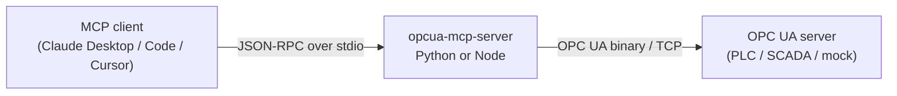

# Architecture

How the pieces fit together, and the three invariants that are easy to break.



## Two runtimes, one tool surface

The repo ships the same MCP server twice — once in Python, once in
TypeScript/Node. They are interchangeable: same tool names, same descriptions,
same parameters, same error wording. Users pick whichever runtime their stack
already has, or no runtime at all via the bundle and executable routes in
docs/install.md.

That interchangeability is not maintained by discipline. It is maintained by
`contract/tools.json`, the single source of truth for the tool surface:

| | How it uses the contract |
|---|---|
| **Node** | Builds its `tools/list` response directly from it. `npm run build` copies it to `build/contract.json` so the npm package is self-contained. |
| **Python** | Builds its `tools/list` response from it too. `MCPServer` still derives a schema from each function signature — that is what it validates the call against — but what is *advertised* is the contract's own. |

For a while the Python half was weaker than that, and it cost exactly what you
would expect. Its advertised schemas were the signature-derived ones, which
carry no per-argument descriptions and flatten every nested structure:
`write_opcua_nodes` offered its `nodes` argument as "an array of object" against
a contract that names `node_id`, `value` and the fifteen legal `data_type`
spellings. Tool *descriptions* matched across the runtimes; the parameter
documentation a model needs in order to call the tool did not. The parity test
compared top-level property names, `required`, and each property's declared
type, so it passed. It now compares the whole schema, and both runtimes advertise
the same document.

Arguments are checked against that same schema before anything else happens, by
`validation.py` / `validation.ts` — twenty lines each over the six JSON Schema
keywords the contract actually uses, driven by one shared table
(`tests/fixtures/argument-validation.json`) that both unit suites run. Before
that, the Node runtime validated nothing at all (the low-level MCP `Server` does
not check `arguments` against the advertised `inputSchema`, and the dispatcher
cast straight off the wire), while the Python runtime validated against the
looser signature-derived schema and worded the refusal its own way.

The contract also pins what the tools *return*. **Every** tool names a shape
from `resultShapes` — ten of the then seventeen named none until 0.4.0, when the contract declared a shape for every tool and consolidated the count to thirteen, and for those
the output format, error wording and defaults were two hand-written copies that
no test compared, which is where every divergence between the two runtimes
turned out to live. `read_opcua_history` produces `historyRecords`, one flat
`{value, timestamp, status}` record per historical value or aggregate interval;
`read_events` and `list_active_alarms` share `eventRecords`. Encoding a value keys on the OPC UA
data type rather than the language one — python-opcua and node-opcua represent
the same reading with entirely different native types (a ByteString is `bytes`
vs a `Buffer`, an Int64 a plain int vs a `[high, low]` pair), so anything
reaching for the runtime type diverges by construction. `tests/fixtures/value-encoding.json`
is the shared table, and both unit suites build the native value for every case
in it and assert the same JSON comes out. That was the second half of interchangeability, and
for a while it was missing: both servers matched on names and parameters but the
Node one returned raw `node-opcua` `DataValue` JSON while the Python one returned
flat records, so a client that learned one misread the other.

`tests/e2e/test_contract_parity.py` starts both servers and asserts each
advertises exactly the contract's applicable tools, with matching descriptions
and byte-identical input schemas, and that what each actually returns satisfies
the declared `resultShape`. `tests/unit/test_contract.py` checks the contract
file itself is well-formed.

### Failures are part of the surface too

`resultShapes` pins what a tool returns when it works. Nothing pinned what it
returns when it does not, and the two runtimes had drifted: the Node server
wrapped every failure as `Error: <message>`, and the Python SDK wraps a
`ToolError` raised inside a tool body as `Error executing tool <name>: <message>`
— so one refusal reached a model as three different sentences depending on which
runtime and which code path produced it. The differential suite compared
*substrings*, which is how it survived being looked at.

`contract/tools.json` -> `errors` is now the wording, `errors.py` / `errors.ts`
only substitute into it, and neither runtime adds a frame of its own: `isError`
already says it is an error. `test_runtime_differential.py` drives a table of
failing calls through both servers and asserts the full text is equal. That
table is also what found the two behavioural differences behind the wording —
the Node runtime never re-checked capability gating at invocation time, and its
`read_opcua_history` reported "requires start_time" as a failure to *read* a node
it had not touched.

**Adding a tool** therefore means editing the contract, adding the per-tool logic
in each runtime, and adding a test — see [CONTRIBUTING.md](../CONTRIBUTING.md).
You never edit a tool list by hand.

The contract covers the **resource** surface too, under `resources`: a URI, name,
description and mimeType, plus a `body` naming the `resultShape` its document
carries. Both servers build their `resources/list` from that entry, and the
parity test reads the resource from each and checks it against the shape.

## Subscriptions: buffered, not pushed

An MCP tool call is request/response, so an OPC UA subscription cannot answer its
caller — the notifications arrive whenever the OPC UA server publishes, long
after `subscribe_opcua_nodes` returned. Each runtime therefore owns the
subscription and *buffers* what it delivers (`src/subscriptions.ts` /
`subscriptions.py`), and the agent reads the accumulation back through
`list_subscriptions` or the `opcua://subscriptions` resource.

The buffer is a ring of `buffer_size` records with a `change_count` beside it, so
an agent that looks away for a minute sees how much it missed rather than
silently losing it. One OPC UA subscription per monitored node, which is what
lets a single `unsubscribe_opcua_nodes` take the whole thing down rather than
leaving an empty subscription behind.

Teardown is not optional, and it is the part that is easy to get wrong: closing
the OPC UA session without deleting its subscriptions leaves the server
publishing into the void until their lifetime expires. Both runtimes delete
first, session second — Python in the lifespan's `finally`, Node on `SIGINT`,
`SIGTERM` *and* `server.onclose`, because the usual end of an MCP session is not
a signal at all but the client closing stdin.

### Why the subscriptions resource is polled, not pushed

Issue #3 asked for `notifications/resources/updated`. It is not offered, on
either runtime, because the two SDK generations no longer agree on what that
means: `@modelcontextprotocol/sdk` 1.x speaks the `resources/subscribe` +
`notifications/resources/updated` pair, while the Python `mcp` 2.x SDK removed
`resources/subscribe` as of protocol 2026-07-28 in favour of
`subscriptions/listen` streams, which the Node SDK does not serve. Under a
current Python client the Python server's `notify_resource_updated` is dropped on
the floor and the client sees nothing.

Shipping the notification on one runtime only would break the interchangeability
this repo is built around, so neither does it. The re-readable resource is the
contract, on both; it is what the parity test enforces, and it is what
`docs/examples.md` documents. If the SDKs converge, this becomes an additive
change on top.

## Policy and capability gating

`contract/tools.json` assigns every tool an access class (`read`, `monitor`,
`alarm-action`, or `control`) and MCP safety annotations. Both runtimes build the
visible catalog from the same metadata, then enforce the selected deployment
policy again at invocation time. The second check is the security boundary: a
client with a cached tool list cannot call a tool that has since been disabled.

The default `observe` profile is fail-closed. `operator` requires exact node and
method allowlists, and validates every member of a batch before the OPC UA call.
`full` is available for tightly controlled deployments. Control tools are hidden
unless the OPC UA channel is secured or a conspicuous lab-only override is set.
An optional versioned JSON policy makes the same rules deployable through normal
configuration management; environment variables can narrow or override it.

### What a value means, and what a value may be

An allowlist authorises a *node*. That was all of write authorization, and it is
the weakest link in the safety story rather than the strongest: an allowlisted
setpoint accepted any number the variant codec would encode, so a model that
correctly identified the right node and hallucinated `9999` instead of `99.9` was
fully authorised. The codec does range-check integers and refuse a lossy Int64 —
but that is *type* safety, and `9999` is a perfectly good Double.

The better bound was already in the address space. OPC UA Part 8 §5.3 defines
`AnalogItemType` with three properties — `EngineeringUnits`, `EURange` (what the
value holds in normal operation) and `InstrumentRange` (what the device can
physically return) — and introduces the first by citing the Mars Climate Orbiter.
A real PLC or SCADA server publishes all three on an analogue tag and nothing
here was reading them.

`node_metadata.py` / `node-metadata.ts` now do, and `resultShapes.nodeValues`
carries them as `engineering`. Two things follow from one piece of work:

- **A reading says what it means.** `51.75` becomes `51.75 °C, normal range 0 to
  150`, which is the difference between a number and a fact. `null` for a node
  that publishes none, which is most nodes.
- **A write is checked against the range the plant itself declared**, before
  anything is sent, unless `OPCUA_ALLOW_OUT_OF_RANGE_WRITES` says otherwise. A
  bound the equipment set beats one a human retyped into a policy file and has to
  keep in step — and it is the only value bound that exists on a deployment with
  no policy file at all.

The policy file adds the bounds the address space cannot express: `min`, `max`,
`enum` and `max_change` per allowlisted node. Both apply, so a policy can only
ever *narrow* what the equipment allows. The split between them is the same one
that keeps the identity allowlist honest — `min`, `max` and `enum` are decidable
from the call alone, so `ToolPolicy.authorize` refuses with nothing sent, while
`max_change` is a bound on the *move* and needs a read, so it lives in the write
path beside the read the type inference already does. A refusal from either
rejects the whole batch.

Cost: two extra round trips for a whole batch on a cold cache — one
`TranslateBrowsePathsToNodeIds` for every property of every uncached node, one
`Read` of whatever resolved — and none on a warm one. Resolving three properties
per node by browsing would have been three round trips per node, which would make
a 500-node read unusable. The cache is dropped when the session is replaced, for
the same reason the capability probes are: a restarted server may not be the same
server.

Capability is re-checked at invocation time as well, for the same reason policy
is: a client may hold a `tools/list` from when the server still reported
HistoricalAccess.

Tool visibility is the intersection of policy and server capability:

Some tools only make sense against servers that support them. Rather than
advertising a tool that always fails, each runtime probes the connected OPC UA
server at `tools/list` time and filters:

| Capability | Probe | Gates |
|---|---|---|
| `history` | Read `AccessHistoryDataCapability` (`ns=0;i=11193`) is true | `read_opcua_history` |
| `aggregate` | Browse `AggregateFunctions` (`ns=0;i=2997`) is non-empty | `read_opcua_history`, and its `aggregate_function` argument |

A tool declares `capabilities` as a *list*, and is offered when the server
reports any member. `read_opcua_history` names both, because a server with
aggregates and no raw history can still answer an aggregate read — gating it on
`history` alone would hide the one thing such a server is good at. The
`aggregate_function` argument is then gated on its own, appearing only where
aggregates exist and carrying that server's own function list in its
description. Capability gating applies to an argument, not only to a tool.

The probes are **best-effort by design**: any failure yields "not supported"
rather than an error. Python reads these through the lifecycle's active session;
it does no network I/O at import time and creates no throwaway probe sessions.

They also run where the answer can *change* — on every (re)connect — and not on
every `tools/list`. That was the other way round, and it was expensive in the one
situation that matters: `list_tools` opened a connection before answering, and
`OpcuaConnection.connect` holds its lock across the whole backoff loop, so
against an unreachable plant every catalogue request paid the full reconnect
budget (7s by default, 32s with `OPCUA_RECONNECT_MAX_RETRY=-1`) and serialised
every concurrent tool call behind it. Clients list at session start, which is
exactly when a plant that is down is most likely to be down.

Both runtimes now warm up once, before serving their first request — Python in
its lifespan, Node in `run()` — and re-probe from the session-replaced callback.
`tools/list` answers from that, with no network I/O at all. Node's probes take the
session as an argument for this reason and not as an optimisation: the callback
runs *inside* `reconnect()`, so a probe that called `ensureConnection()` from
there would re-enter the connect path it is standing in.

Convergence does not depend on a notification. A client that listed while the
plant was down sees the core tools; any tool call brings the connection up and
re-probes; the next `tools/list` carries the whole surface.

### Why the tool list is polled too

`notifications/tools/list_changed` is not sent, on either runtime, for the same
reason `notifications/resources/updated` is not — and it is the same SDK split.
`@modelcontextprotocol/sdk` 1.x can deliver it over stdio; the Python `mcp` 2.x
SDK derives `tools.listChanged` from whether `subscriptions/listen` is served
(`mcp/server/lowlevel/server.py`), that method exists only for streamable HTTP,
and at protocol 2026-07-28 a change notification sent on the shared channel is
dropped with a debug log. Announcing the catalogue on Node only would mean a
client written against one runtime behaving differently against the other, which
is the thing this repo is organised to prevent.

The catalogue is re-listable at any time, and unlike a resource update there is
no information a client can only learn from the notification — which is why
polling is an honest answer here and was not for issue #3.

> There are three mocks, on purpose. The main one (`packages/mock-server/`,
> :4840) enables history and advertises **no** aggregate functions, so the suite
> can assert the aggregate tool stays hidden when unsupported. The second
> (`packages/mock-server-aggregate/`, :4841) advertises aggregates, so the read
> path itself is covered on both runtimes. The third
> (`packages/mock-server-alarms/`, :4842) has a real alarm condition — see below.

The event tools are deliberately **not** gated. Every OPC UA server has a Server
object with an EventNotifier, and a server that raises nothing simply buffers
nothing; there is no capability to probe that would make hiding them more honest
than offering them. A server without Alarms & Conditions is told apart at call
time instead: `list_active_alarms` reports that its ConditionRefresh call failed
and that the server may not implement A&C, rather than returning an empty list a
model would read as "no alarms".

## Events and Alarms & Conditions

Events are buffered exactly as the data-change subscriptions above are, for the
same reason, and their subscriptions come down on the same teardown path:
`subscribe_events` starts an OPC UA subscription whose monitored item parks what
arrives, and `read_events` drains it. What differs is what is asked for — an
event filter rather than a monitored value — and that `list_active_alarms`
sidesteps the buffer entirely: it makes its own short-lived subscription, calls
ConditionRefresh, and collects the retained conditions the server replays
between the RefreshStart and RefreshEnd events.

`contract/tools.json` -> `events` is what keeps the two runtimes saying the same
thing: one list of OPC UA browse paths that is simultaneously the EventFilter
select clauses both servers send and the field order of an `eventRecords`
record. Two details of it are load-bearing and non-obvious:

- Every path is resolved against **BaseEventType**, which Part 4 §7.4.4.5 says
  makes a server evaluate it without regard to the event's own type. That is how
  one filter selects `AckedState/Id` from a condition and gets `null` — rather
  than an error — from a plain event, and so how one record shape covers both.
- **ConditionId** is not a component of ConditionType at all; it is the NodeId
  attribute of the condition instance, selected with an empty browse path. It is
  also what `acknowledge_alarm` calls the Acknowledge method on, so getting it
  wrong is not cosmetic — the tool would have nothing to acknowledge.

`acknowledge_alarm` takes only the `event_id` a model has just seen, because both
servers remember which condition each event they reported came from. The
condition can still be passed explicitly for an event that came from somewhere
else.

## Staying connected

The connection is expected to break — a plant network drops, a controller is
power-cycled, a switch reboots — so neither server treats a live session as a
precondition it was handed once at startup. Both start whether or not the
endpoint answers, and both rebuild a dead session on the next tool call.

The two runtimes reach that from opposite directions, which is the interesting
part:

- **Node.** `node-opcua` repairs its own channel: on `connection_lost` it retries
  per `connectionStrategy`, re-activates the *same* `ClientSession` and
  re-creates its subscriptions, and nothing above `connection.ts` notices. That
  module's job is to follow along (`connection_lost` → `connection_reestablished`
  → `close`) and to know when the library has given up, because a client that has
  emitted `close` stays dead forever.
- **Python.** `python-opcua` has no reconnection at all; a `Client` whose socket
  has gone raises on every subsequent call. So `connection.py` owns the whole of
  it — the backoff loop, and a *fresh* `Client` per attempt, because a restarted
  server may be presenting a new certificate and building a secured client is
  what fetches it.

What they share is the decision-making, and it is shared deliberately:
`OPCUA_RECONNECT_*` and `OPCUA_SESSION_TIMEOUT_MS` mean the same thing on both
and produce the same waits (`reconnectBudgetMs` / `reconnect_budget_ms` are
pinned against each other in `tests/unit/test_reconnect.py`), and one list of
status codes and socket errors — `DEAD_SESSION_MARKERS`, kept in step on both
sides — decides what is worth reconnecting for. That list is the whole
distinction between a failure of the *connection* and a failure of the
*request*: a `BadNodeIdUnknown` would fail identically on a fresh session, so
retrying it would only hide the real answer.

Whether a failed call may be *repeated* is not the connection layer's to decide
either. It is settled where the tool is declared, by `contract/tools.json` ->
`retryPolicy`, which is deliberately **not** `annotations.idempotentHint`. Both
runtimes used to read the annotation for it, and the two answer different
questions: `idempotentHint` tells the *model* whether calling a tool twice is
meaningful, while this decides whether the *transport* may put a second request
on the wire after an outcome it does not know. `write_opcua_nodes` is idempotent
in the first sense — writing 99.9 twice leaves 99.9 — and was therefore
automatically re-sent after a lost response, which Part 4 §5.11.4 says nothing
justifies: a Write may partially succeed, rollback is the client's problem and
the operation order is undefined, so a dead session never proved the write had
not landed.

The three policies, and who has which:

| Policy | Tools | What happens |
| --- | --- | --- |
| `resend` | the six reads | Rebuild, then run the request again. |
| `reconnectOnly` | the four monitor tools | Rebuild, report the original failure. A subscription lives on the session, so it died with it: the failure is complete, not uncertain. |
| `uncertainOutcome` | `write_opcua_nodes`, `call_opcua_method`, `acknowledge_alarm` | Rebuild, then fail with `errors.uncertainOutcome`, which says the request may or may not have reached the plant and names what it was aimed at. |

The connection is rebuilt whatever the policy, so the next call finds a live
session either way. What changes is only what this server is willing to claim.

A re-sent request is authorized *again* before it goes out. `reconnect()` has
just re-read the server's `NamespaceArray` and re-bound it into the policy —
because a restarted server may have loaded its namespaces in a different order,
which is the entire reason the `nsu=` allowlist form exists — so the mapping the
first attempt was authorized against is not necessarily the mapping the second
resolves against. The second attempt gets its own `allowed` audit line, and every
line carries an `attempt` number, because one call reaching the plant twice is
two facts and not one.

The capability gate runs *after* the connection, not before it. The capability
answers are filled in by the reconnect callback, so a process that started while
the plant was unreachable still holds its startup defaults, and checking them
first refused `read_opcua_history` as "the server advertises none of: history"
without ever asking the server. Unknown is not absent. `tools/list` is unchanged
and still does no network I/O — that distinction is the whole of #83.

A rebuilt session is a *different* session, and an OPC UA subscription belongs to
the session that created it. So both subscription managers can re-create what
they were monitoring on a new one (`reattach`), keeping the IDs the agent holds
and the changes already buffered; only the gap during the outage is missing, and
nothing client-side could have filled it. A subscription the server will not take
back is dropped rather than left in `list_subscriptions` as a handle that will
never deliver again.

`get_server_status` is the one tool exempt from all of this, because it is the
one tool whose output *is* the report: it never fails for being disconnected, it
says `connected: false` and why, and every other tool's "not connected" error
points at it by name.

## The three invariants

**1. `stdout` belongs to the transport.** MCP speaks JSON-RPC over stdio; a stray
`print()` or `console.log` corrupts the stream and the client disconnects with a
parse error. Python logs to `stderr` explicitly; the Node server reassigns
`console.log` to `console.error` at startup, because `node-opcua` logs PKI and
certificate messages on its own.

**2. Nothing hardcodes a version.** The version is single-sourced from each
package manifest — Node stages it into `build/version.json` at build time, Python
reads its installed distribution metadata. `tests/unit/test_version_manifests.py`
fails the build if a literal reappears or the manifests drift apart.

**3. The published artifact is what users get, not the source tree.** Paths that
resolve in a checkout may not resolve in a wheel or a tarball, and a dependency
range that resolves to one major today may resolve to a breaking one tomorrow.
Both have already shipped bugs here. `tests/smoke/` builds the real artifacts,
installs them in isolation, and drives the installed entry points from outside
the repo.

There are now five such artifacts, and the two newest stray furthest from the
source tree: the `.mcpb` bundle inlines the contract and bundles
node-opcua-client's whole CommonJS dependency tree into one file, and the
single-file executables freeze an interpreter around it. Both can break while every other test stays
green, so both are built and driven over MCP in `tests/smoke/`. See
[install.md](install.md) for what each artifact is for.

## Layout

```
contract/tools.json          single source of truth for the tool + resource surface,
                             including every failure message and result shape
packages/server-python/      mcp MCPServer + opcua (FreeOpcUa)
  src/opcua_mcp_server/      config · security · contract · datetimes
                             · capabilities · aggregates · records
                             · subscriptions · events · connection
                             · diagnostics · errors · notices · validation
                             · limits · transport_limits · version
                             · install · cli · server
  packaging/                 PyInstaller spec for the single-file executable
packages/server-node/        @modelcontextprotocol/sdk + node-opcua-client
  src/                       config · security · contract · dates · records
                             · subscriptions · events · connection
                             · diagnostics · errors · notices · validation
                             · limits · transport-limits · tools
                             · install · index · sea
  mcpb/manifest.json         MCP bundle manifest (Claude Desktop extension)
  scripts/                   build steps: npm package · .mcpb · executable
packages/mock-server/        simulated PLC/sensors (:4840, no aggregates)
packages/mock-server-aggregate/  aggregate-capable mock (:4841)
packages/mock-server-alarms/     Alarms & Conditions mock (:4842)
tests/                       unit/ (fast) · e2e/ (both servers, secured and not)
                             · smoke/ (artifacts) · fixtures/ (secured mock, PKI)
examples/                    standalone demo scripts
```

## Security posture

Connection security is configured through the environment, by the same variables
on both runtimes: `OPCUA_SECURITY_POLICY`, `OPCUA_SECURITY_MODE`,
`OPCUA_CLIENT_CERT`, `OPCUA_CLIENT_KEY`, `OPCUA_USERNAME` and `OPCUA_PASSWORD`
(see [Configuration](../README.md#configuration)). Each runtime parses and
validates them in one module — `security.ts` / `security.py` — which the client
factory, the capability probes and the startup check all go through, so a
probe cannot end up on a different security footing than the session it
precedes.

Write conversion uses the target node's server-reported `Variant` metadata, not
the host language type of its current value. The shared codec performs strict
boolean parsing, integer range checks, lossless Int64/UInt64 conversion,
base64 ByteString decoding, ISO DateTime parsing and element-wise array
conversion. A mutating operation is repeated only when the contract declares it
idempotent *and* the failure was the session dying — never on an error the OPC
UA server itself returned; see [Staying connected](#staying-connected).

Address-space discovery is breadth-first and bounded by both depth and inspected
node count, with a visited set for cyclic reference graphs. Its response says
when the budget truncated the search; callers can select a narrower root or
increase the explicit limit instead of triggering an unbounded plant-wide crawl.

Browse was bounded from the start and three other requests were not, which
`contract/tools.json` -> `limits` now fixes. A raw history read of a year of
100ms data is the same request that never returns — `num_values: 0` used to mean
"every reading in the range" and now means "as many as allowed"
(`maxHistoryValues`), with a trailing notice when the cap is what stopped it, the
way `read_events` already reports dropped events. A batch read is capped at
`maxNodesPerRead` and *refused* rather than truncated, because a short list of
readings is indistinguishable from a complete one. And because there is one OPC
UA subscription per monitored node — which is what lets a single unsubscribe take
the whole thing down — an unbounded `subscribe_opcua_nodes` asks a PLC for one
subscription per node past whatever it is willing to hold, so `maxSubscriptions`
counts them. An aggregate read is deliberately uncapped: how many results it
returns is decided by `processing_interval`, which is the whole point of asking
for one.

Identity is derived rather than restated: with a client certificate configured,
both runtimes announce the `subjectAltName` URI of that certificate as the
session's ApplicationUri, which is the value servers check it against. That is
free on the Node side (node-opcua reads the certificate itself) and explicit on
the Python side (`certificate_application_uri`), because python-opcua would
otherwise announce its own `urn:freeopcua:client` and be refused by equipment the
Node runtime got into with the same files.

What a server may send *us* is bounded too, from `contract/tools.json` ->
`transport`, and this one is a patch rather than a setting on the Python side.
CVE-2022-25304 is a missing limit on chunk reassembly: `python-opcua` appends
every Intermediate chunk to a list with nothing counting it, so a server that
never terminates the message exhausts the client. There is no fixed version and
there will not be one. Both runtimes advertise `MaxChunkCount` and
`MaxMessageSize` in the Hello — python-opcua's own defaults are `0`, meaning "no
limit" — and both enforce them on receipt, because advertising binds only a
server that chooses to obey: node-opcua does it itself, and the Python runtime
wraps `SecureConnection._receive`. See [SECURITY.md](../SECURITY.md) for the
residual risk, and `transport_limits.py` for why patching a dependency was judged
the lesser evil.

The **default is `None`/`None`**: unauthenticated and unencrypted, appropriate
for the bundled mock and local development and **not** appropriate for
production industrial systems. Both servers warn on stderr when running that
way. For what the secured path does and does not verify — notably that the
server certificate is not pinned — see [SECURITY.md](../SECURITY.md), and for
certificate generation and trust setup [certificates.md](certificates.md).
